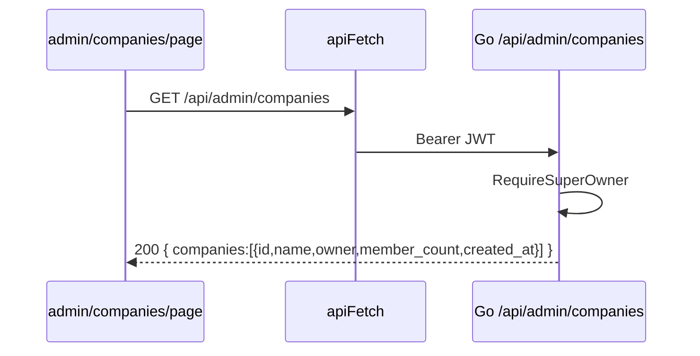

# A2 — Component Architecture

Components across the two repos, their interfaces, and the sequences that
bind them. Go snippets are **architecture pseudocode** in Go idiom — mirror
the existing patterns in `ulabchat-backend` (chi router, pgx pool, sqlc
generated queries) at implementation time.

---

## 1. Backend (`ulabchat-backend`) — new components

```
internal/
  auth/
    supabase_jwt.go     // existing: validates Bearer JWT -> userID (sub)
    super_owner.go      // NEW: RequireSuperOwner middleware
  admin/
    handler.go          // NEW: chi handlers for /api/admin/*
    service.go          // NEW: ProvisionCompany, ListCompanies (orchestration)
    input.go            // NEW: parseCreateCompanyInput (pure, unit-tested)
  store/                // sqlc-generated + thin wrappers
    super_owners.sql.go // NEW: IsSuperOwner(ctx, uid) bool
    companies.sql.go    // NEW: InsertAccount, InsertOwnerProfile, ListCompanies
  authz/
    gotrue_admin.go     // NEW: GoTrue Admin API client (create/get/delete user, invite link)
```

### 1.1 Middleware — `RequireSuperOwner`

```go
// Chains after the existing JWT middleware that sets userID in ctx.
func RequireSuperOwner(store Store) func(http.Handler) http.Handler {
  return func(next http.Handler) http.Handler {
    return http.HandlerFunc(func(w http.ResponseWriter, r *http.Request) {
      uid, ok := auth.UserID(r.Context())        // set by JWT middleware
      if !ok { respond.Unauthorized(w); return } // 401  (EC-4)
      isSuper, err := store.IsSuperOwner(r.Context(), uid) // single DB lookup, ADR-3
      if err != nil { respond.Internal(w); return }
      if !isSuper { respond.Forbidden(w, "super_owner role required"); return } // 403 (EC-3)
      next.ServeHTTP(w, r)
    })
  }
}
```
- **TEST:** no/invalid JWT → 401. Valid non-super-owner → 403. super_owner → next.
- **TEST:** super_owner with no company/profile still passes (role is on its own axis).

### 1.2 Router wiring

```go
r.Route("/api/admin", func(r chi.Router) {
  r.Use(auth.RequireJWT)          // existing
  r.Use(auth.RequireSuperOwner)   // NEW
  r.Post("/companies", admin.CreateCompany)
  r.Get("/companies", admin.ListCompanies)
  r.Get("/companies/{id}", admin.GetCompany)
})
// GET /api/admin/me is JWT-only (introspection), NOT behind RequireSuperOwner.
r.With(auth.RequireJWT).Get("/api/admin/me", admin.Me)
```

### 1.3 Provisioning service — `ProvisionCompany`

Transaction boundary is the key design point (ADR-4). The two table
inserts are **one pgx transaction**; the GoTrue user-creation is an
external HTTP call outside the tx, compensated on failure.

```go
func (s *Service) ProvisionCompany(ctx, in CreateCompanyInput) (Company, error) {
  // Step 1: reject existing user  (EC-1)
  if u, _ := s.gotrue.GetUserByEmail(ctx, in.OwnerEmail); u != nil {
    return Company{}, ErrConflict
  }
  // Step 2: create owner auth user (external, pre-tx)
  ownerID, err := s.gotrue.CreateUser(ctx, in.OwnerEmail, in.OwnerFullName)
  if err != nil { return Company{}, err }

  // Steps 3-4: ONE transaction (INV-2: owner supplied up front)
  company, err := s.store.WithTx(ctx, func(q Queries) (Company, error) {
    acc, err := q.InsertAccount(ctx, in.Name, ownerID)   // owner_user_id = ownerID
    if err != nil { return Company{}, err }
    if err := q.InsertOwnerProfile(ctx, ownerID, acc.ID, in.OwnerEmail, in.OwnerFullName); err != nil {
      return Company{}, err                              // triggers ROLLBACK
    }
    return toCompany(acc, ownerID, in), nil
  })
  if err != nil {
    _ = s.gotrue.DeleteUser(ctx, ownerID)  // COMPENSATE step 2  (EC-2)
    return Company{}, err
  }
  // Step 5: onboarding link (fire-and-forget; log-and-continue)
  go s.gotrue.SendInviteLink(ctx, in.OwnerEmail)
  return company, nil
}
```
- **TEST:** happy path → account + owner profile + auth user; owner_user_id matches.
- **TEST:** tx failure → auth user deleted (no orphan) (EC-2).
- **TEST:** existing email → ErrConflict, zero writes (EC-1).

### 1.4 Handler mapping (errors → HTTP)

Reuse the backend's existing error-envelope helper (mirror of
`src/lib/api/v1/respond.ts` on the frontend):

| Service outcome | HTTP |
|-----------------|------|
| `ErrValidation` | 400 (field errors) |
| `ErrConflict`   | 409 |
| ok (create)     | 201 |
| ok (list/get)   | 200 |
| middleware      | 401 / 403 |
| unexpected      | 500 |

## 2. Supabase

- `auth.users` — owner identities (created via GoTrue Admin API).
- `super_owners`, `accounts`, `profiles` — see `A3`.
- RLS unchanged for ordinary users; **no** browser-facing cross-tenant
  read policy is added (ADR-2). The Go backend reads via a service-role
  pgx connection.

## 3. Frontend (this repo) — new components

Frontend does **no** provisioning logic; it renders the console and calls
the Go API. Consult `node_modules/next/dist/docs/` for route-group +
`use client` conventions before coding.

```
src/app/(admin)/
  layout.tsx                 // server: verify super_owner, else redirect('/')
  admin/companies/page.tsx   // list  -> GET  /api/admin/companies
  admin/companies/new/page.tsx     // form  -> POST /api/admin/companies
  admin/companies/[id]/page.tsx    // detail-> GET  /api/admin/companies/{id}
src/components/auth/require-super-owner.tsx   // UX-only nav gate
src/hooks/use-super-owner.tsx                 // GET /api/admin/me -> {isSuperOwner}
src/lib/admin/companies.ts                    // apiFetch wrappers + response types
```

### 3.1 Server-side gate for the route group

The `(admin)/layout.tsx` must decide access **server-side**. Since the
authority lives in Go, the layout calls the backend:

```
LAYOUT (admin)/layout.tsx [server component]:
  { isSuperOwner } = await apiServer('/api/admin/me')  // forwards the session JWT
  IF not isSuperOwner: redirect('/')                   // no console leak (EC-3)
  RETURN <AdminShell>{children}</AdminShell>
```
- **TEST (e2e):** non-super-owner hitting /admin/* is redirected (never 200).

### 3.2 Data flow — list



## 4. What is explicitly reused (no new build)

- Adding `admin`/`agent`/`viewer` to a company → **existing** invitation
  flow: backend invite endpoints + `src/components/settings/
  invite-member-dialog.tsx` + `src/app/join/[token]/page.tsx` (FR-5).
- JWT validation middleware, error envelope, pgx pool, sqlc tooling —
  all pre-existing backend infrastructure.
